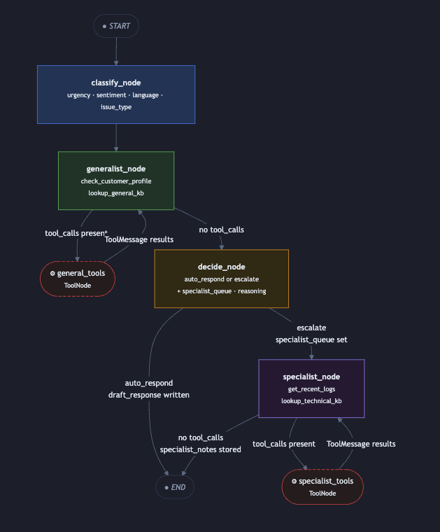
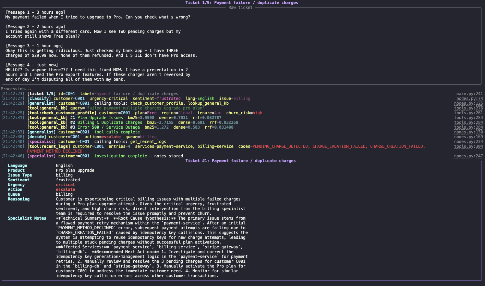
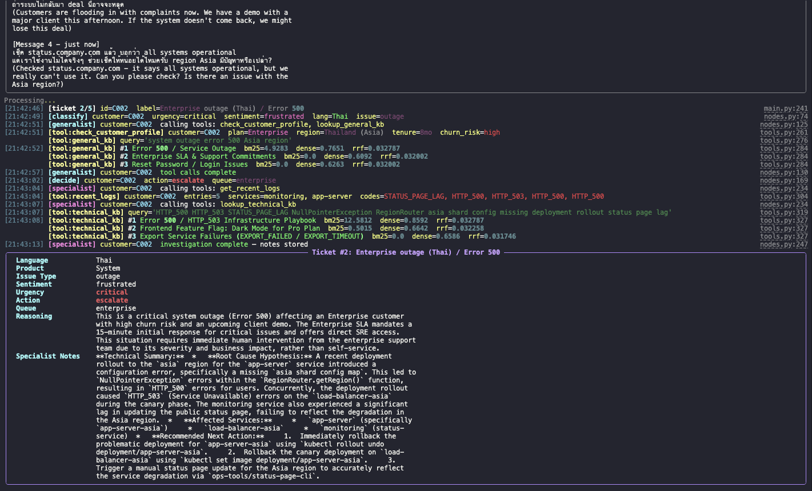
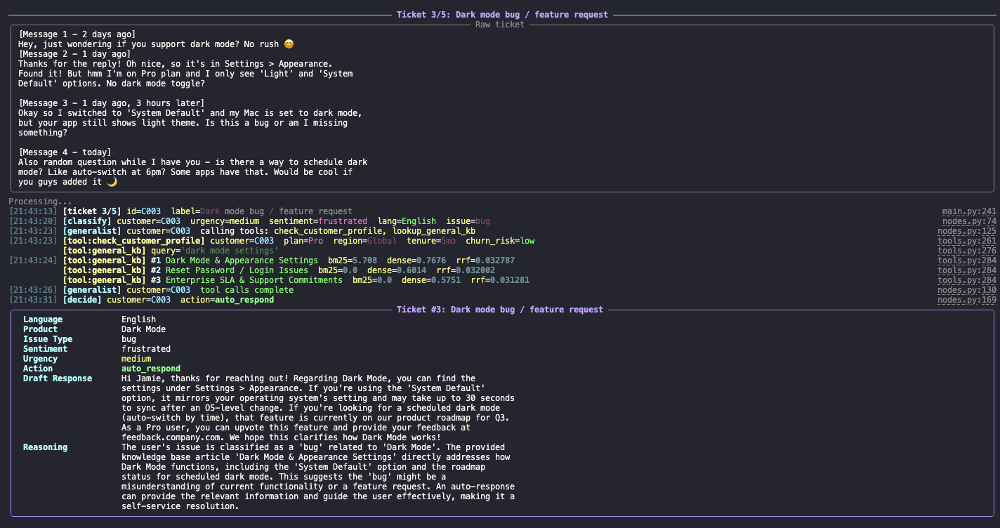
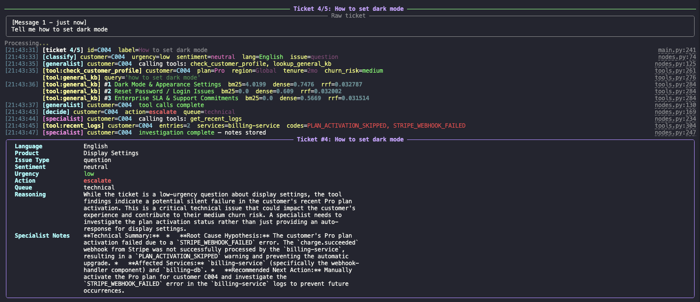
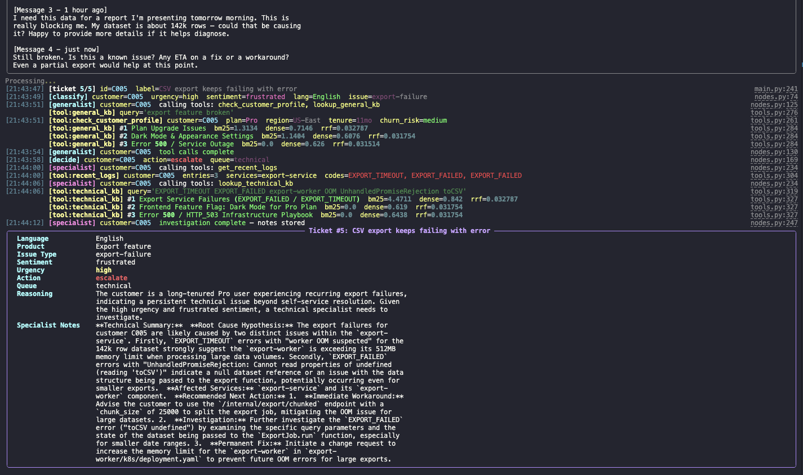

# Support Ticket Triage Agent

An AI agent that classifies, researches, and routes incoming customer support tickets using [LangGraph](https://github.com/langchain-ai/langgraph). Supports both OpenAI GPT-4o-mini and Google Gemini 2.5-flash.



<u>⚠️ Note</u>: This project passes the test with only the Gemini API Key due to the availability of a free API key. <u><b>If the OpenAI API key is not working</b></u>, please report the issue and continue using the Gemini API key while awaiting a fix.

## What it does

For each ticket the agent runs a four-stage pipeline:

1. **Classify** — extracts urgency (critical / high / medium / low), product, issue type, customer sentiment, and detected language (handles multilingual tickets including Thai)
2. **Generalist research** — ReAct tool-calling loop using:
   - `check_customer_profile` — account plan, tenure, region, churn risk
   - `lookup_general_kb` — user-facing FAQ / documentation snippets (hybrid BM25 + embeddings search)
3. **Decide** — chooses one of two actions:
   - `auto_respond` — writes a draft reply in the ticket's language and ends
   - `escalate` — assigns to billing / technical / enterprise / general queue and triggers specialist investigation
4. **Specialist investigation** *(escalated tickets only)* — second ReAct loop using:
   - `get_recent_logs` — recent error logs for the customer
   - `lookup_technical_kb` — engineering runbooks with error codes and infrastructure solutions

## Project structure

```
support-ticket-triage-agent/
├── src/triage/
│   ├── state.py        # TicketState TypedDict + Classification / Decision Pydantic schemas
│   ├── tools.py        # Tool definitions + hybrid RAG (BM25 + embeddings, RRF fusion)
│   ├── nodes.py        # classify_node, generalist_node, decide_node, specialist_node
│   ├── graph.py        # LangGraph assembly + conditional routing
│   ├── llm.py          # LLM factory — switches between OpenAI and Gemini via LLM_PROVIDER
│   ├── data_store.py   # CSV loader + customer profile / error log queries
│   └── main.py         # CLI entry-point + 5 sample tickets
├── data/
│   ├── customers.csv   # Customer profiles (plan, tenure, region, churn risk)
│   └── error_logs.csv  # Technical error logs with timestamps & error codes
├── pyproject.toml
└── .env.example
```

## Setup

### Prerequisites

- Python 3.11+
- An OpenAI API key and/or a Google API key

### Install

```bash
# 1. Clone / unzip the repo
cd support-ticket-triage-agent

# 2. Create a virtual environment (using uv or plain venv)
python -m venv .venv
source .venv/bin/activate        # Windows: .venv\Scripts\activate

# 3. Install dependencies
pip install -e .

# 4. Set your API keys
cp .env.example .env
# Edit .env — set LLM_PROVIDER and the corresponding key
```

> If you prefer [uv](https://github.com/astral-sh/uv): `uv sync && uv run triage`

### Run

```bash
# Using the installed script
triage

# Or directly
python -m triage.main
```

The agent processes all five sample tickets and prints colour-coded results to the terminal.

## Sample output (abbreviated)

```
──────────────────── Ticket 1/5: Payment failure / duplicate charges ────────────────────
┌── Ticket #1: Payment failure / duplicate charges ─────────────────────────────────────┐
│ Language      English                                                                  │
│ Product       Pro plan / billing                                                       │
│ Issue Type    billing                                                                  │
│ Sentiment     frustrated                                                               │
│ Urgency       critical                                                                 │
│ Action        escalate                                                                 │
│ Queue         billing                                                                  │
│ Reasoning     Multiple duplicate charges ($89.97 total), no Pro access granted,       │
│               customer threatening chargeback with a hard 2-hour deadline.             │
└────────────────────────────────────────────────────────────────────────────────────────┘
```

## Graph architecture

```
START → classify → generalist ⇄ general_tools (loop) → decide → auto_respond → END
                                                               ↘ escalate → specialist ⇄ specialist_tools (loop) → END
```

- `classify` — structured output (no tools)
- `generalist` — tool-calling ReAct loop; re-runs until no tool calls remain
- `general_tools` — prebuilt `ToolNode` for `check_customer_profile` + `lookup_general_kb`
- `decide` — structured output based on classification + research findings
- `specialist` — second ReAct loop; only triggered on escalation
- `specialist_tools` — prebuilt `ToolNode` for `get_recent_logs` + `lookup_technical_kb`

## Adding a new test ticket

Three files may need to be updated depending on the scenario you want to test.

### 1. `src/triage/main.py` — always required

Add an entry to `SAMPLE_TICKETS`:

```python
{
    "customer_id": "C006",                 # must match a row in customers.csv
    "label": "Short human-readable label", # used in terminal output only
    "ticket_text": "The raw ticket text the customer wrote.",
},
```

### 2. `data/customers.csv` — always required

Add a row for the new `customer_id`. All columns are used by `check_customer_profile`:

```
customer_id,name,plan,region,seats,tenure_months,login_frequency,previous_support_tickets,previous_critical_issues,upgrade_attempts,churn_risk,notes
C006,Jane Smith,Pro,Global,1,12,daily,2,0,0,low,Long-time Pro user.
```

| Column | Values |
|---|---|
| `plan` | `Free` / `Pro` / `Enterprise` |
| `region` | e.g. `Global`, `Thailand (Asia)` |
| `login_frequency` | `daily` / `weekly` / `occasional` |
| `churn_risk` | `low` / `medium` / `high` |

### 3. `data/error_logs.csv` — only needed for escalation scenarios

If you want the specialist node to find relevant logs, add rows matching the `customer_id`. Leave this file unchanged for tickets you expect to `auto_respond`.

```
log_id,customer_id,session_id,timestamp,level,service,error_code,message,affected_component
LOG020,C006,WS020,2026-03-22 10:00:00,ERROR,export-service,EXPORT_TIMEOUT,Export job exceeded 30s limit for dataset >100k rows,export-worker
```

| Column | Notes |
|---|---|
| `level` | `ERROR` / `WARN` / `INFO` |
| `error_code` | Should match codes in the technical KB for best specialist output |

---

## Configuration

| Variable | Default | Description |
|---|---|---|
| `LLM_PROVIDER` | `gemini` | Which LLM to use: `openai` or `gemini` |
| `OPENAI_API_KEY` | *(required if provider is openai)* | OpenAI API key |
| `GOOGLE_API_KEY` | *(required if provider is gemini)* | Google API key for Gemini |

To change the model, edit the `llm.py` factory or the `model=` argument in [src/triage/nodes.py](src/triage/nodes.py).

## Result

Here's result examples :

Ticket 1 :


Ticket 2 :


Ticket 3 :


Ticket 4 :


Ticket 5 :

